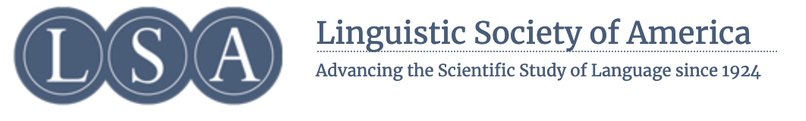



These are some of the organizations outside academia that I'm currently affiliated, from Celtic organizations to Charitable Foundations. 

Linguistic Society of America  
======
* The Linguistic Society of America is a learned society for the field of linguistics. Founded in New York City in 1924, the LSA works to promote the scientific study of language.
* 

