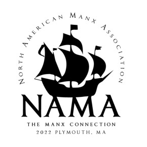
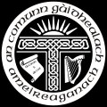
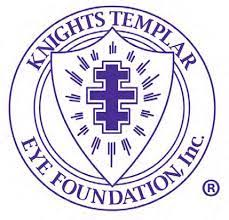



These are some of the organizations outside academia that I'm currently affiliated, from Celtic organizations to Charitable Foundations. 

North American Manx Association 
======
* NAMA is a cultural heritage institution founded in 1928. Most of our 850 members are second and third-generation North Americans and some are Manx.
* 

American Gaelic Society
======
* An Comunn Gàidhealach Ameireaganach (ACGA) is the American Scottish Gaelic Society. ACGA's mission is to nurture and preserve Scottish Gaelic language and culture, particularly in North America.
* 

Knights Templar Eye Foundation
======
* The Knights Templar Eye Foundation, incorporated in 1956, is a charity sponsored by the Grand Encampment of Knights Templar. The Foundation is governed by a Board of Trustees comprised of the six elected officers of the Grand Encampment, all Past Grand Masters of the Grand Encampment, and six trustees-at-large elected from and by the membership for a term of nine years. It is exempt from federal income taxation under Section 501 (c) 3 of the Internal Revenue Code and contributions made to the Foundation are deductible by donors.
* 

